# Login Audit Report - Critical Issues Identified

## Executive Summary

This audit identifies **5 critical issues** preventing the login functionality from working correctly in the LogiMap application. The root cause is improper session management between client-side and server-side Supabase authentication in Next.js 15+.

---

## Critical Issues

### 1. Missing Middleware for Session Management ⚠️ CRITICAL

**Location:** Project root (missing file)

**Issue:** The project lacks a `middleware.ts` file, which is essential for:
- Automatically refreshing Supabase sessions
- Ensuring cookies are properly maintained across requests
- Handling authentication redirects

**Impact:** Sessions expire without refresh, causing users to be logged out unexpectedly.

**Evidence:**
```bash
# No middleware.ts file exists in the project
```

**Reference:** [Supabase Next.js Middleware Guide](https://supabase.com/docs/guides/auth/server-side/nextjs?router=app#creating-a-middleware)

---

### 2. Session Not Persisting to Server-Side ⚠️ CRITICAL

**Location:** [`app/(auth)/login/page.tsx`](app/(auth)/login/page.tsx:56-64)

**Issue:** The login flow uses `supabase.auth.setSession()` on the client side, but this doesn't properly sync with the server-side Supabase client.

**Current Code:**
```typescript
// Line 56-64 in login/page.tsx
const { error: sessionError } = await supabase.auth.setSession({
  access_token: data.data.accessToken,
  refresh_token: data.data.refreshToken,
});
```

**Problem:** The client-side session is stored in localStorage by default, but server components read from cookies. This creates a disconnect where:
- Client thinks user is authenticated
- Server components cannot read the session
- Dashboard layout redirects to `/login` because `getCurrentUser()` returns null

**Impact:** Users cannot access protected routes after login.

---

### 3. Cookie Storage Not Configured in Client ⚠️ CRITICAL

**Location:** [`lib/supabase/client.ts`](lib/supabase/client.ts:16-25)

**Issue:** The Supabase client is configured with `persistSession: true` but doesn't specify cookie storage.

**Current Code:**
```typescript
// Line 16-25 in lib/supabase/client.ts
return createSupabaseClient<Database>(
  supabaseUrl,
  supabaseAnonKey,
  {
    auth: {
      persistSession: true,
      autoRefreshToken: true,
    },
  }
);
```

**Problem:** Without explicit cookie storage configuration, Supabase defaults to localStorage, which is not accessible to server-side code.

**Required Fix:**
```typescript
import { createBrowserClient } from '@supabase/ssr';

export const createClient = () => {
  return createBrowserClient<Database>(
    process.env.NEXT_PUBLIC_SUPABASE_URL!,
    process.env.NEXT_PUBLIC_SUPABASE_ANON_KEY!,
    {
      auth: {
        persistSession: true,
        autoRefreshToken: true,
        detectSessionInUrl: false,
      },
    }
  );
};
```

**Impact:** Server components cannot read authentication state.

---

### 4. Login API Doesn't Set Cookies ⚠️ CRITICAL

**Location:** [`app/api/auth/login/route.ts`](app/api/auth/login/route.ts:135-149)

**Issue:** The login API returns tokens in the response body but doesn't set them as HTTP-only cookies.

**Current Code:**
```typescript
// Line 135-149 in app/api/auth/login/route.ts
return NextResponse.json(
  {
    success: true,
    message: 'Login successful',
    data: {
      userId: newProfile.id,
      email: newProfile.email,
      fullName: newProfile.full_name,
      distributorSlug,
      accessToken: authData.session.access_token,
      refreshToken: authData.session.refresh_token,
    },
  },
  { status: 200 }
);
```

**Problem:** Tokens are returned in JSON response but not set as cookies. The client then tries to set the session manually, which doesn't persist to cookies.

**Required Fix:** Set cookies in the API response:
```typescript
const response = NextResponse.json(
  {
    success: true,
    message: 'Login successful',
    data: {
      userId: newProfile.id,
      email: newProfile.email,
      fullName: newProfile.full_name,
      distributorSlug,
    },
  },
  { status: 200 }
);

// Set cookies
response.cookies.set('sb-access-token', authData.session.access_token, {
  httpOnly: true,
  secure: process.env.NODE_ENV === 'production',
  sameSite: 'lax',
  maxAge: 60 * 60, // 1 hour
});

response.cookies.set('sb-refresh-token', authData.session.refresh_token, {
  httpOnly: true,
  secure: process.env.NODE_ENV === 'production',
  sameSite: 'lax',
  maxAge: 60 * 60 * 24 * 7, // 7 days
});

return response;
```

**Impact:** Session tokens are not persisted securely.

---

### 5. Race Condition in Login Flow ⚠️ HIGH

**Location:** [`app/(auth)/login/page.tsx`](app/(auth)/login/page.tsx:54-70)

**Issue:** The login flow has a race condition where the redirect happens before the session is properly persisted.

**Current Flow:**
```typescript
// Line 54-70
console.log('Login successful, setting session...');
const { error: sessionError } = await supabase.auth.setSession({
  access_token: data.data.accessToken,
  refresh_token: data.data.refreshToken,
});

if (sessionError) {
  console.error('Session error:', sessionError);
  throw new Error('Error al establecer la sesión. Por favor, intenta nuevamente.');
}

console.log('Session set successfully, redirecting to dashboard...');
router.push(`/dashboard/${data.data.distributorSlug}`);
```

**Problem:** Even though `setSession()` is awaited, the redirect happens immediately. The session might not be fully persisted to cookies before the dashboard layout tries to read it.

**Impact:** Dashboard layout fails to authenticate user and redirects back to login.

---

## Additional Issues

### 6. No Logout Functionality

**Issue:** There's no logout endpoint or functionality to properly clear the session.

**Impact:** Users cannot securely log out.

---

### 7. Missing Error Handling for RPC Function

**Location:** [`app/api/auth/login/route.ts`](app/api/auth/login/route.ts:106-121)

**Issue:** The RPC function `get_distributor_users` might not exist in the database, causing errors.

**Evidence:** The SQL file [`create-rpc-function.sql`](create-rpc-function.sql) exists but may not have been executed.

**Impact:** Login fails with "Error al verificar tu acceso" if RPC function is missing.

---

## Root Cause Analysis

The fundamental issue is that the application is using a **hybrid authentication approach** that doesn't work properly in Next.js 15+:

1. **Client-side** uses `@supabase/supabase-js` with localStorage (default)
2. **Server-side** uses `@supabase/ssr` with cookies
3. **No middleware** to sync between the two
4. **No cookie storage** configured on the client

This creates a disconnect where the client thinks the user is authenticated, but the server cannot read the session.

---

## Recommended Solution Architecture

### Phase 1: Fix Cookie Storage (Foundation)

1. **Update `lib/supabase/client.ts`** to use `@supabase/ssr` browser client with cookie storage
2. **Create `middleware.ts`** for automatic session refresh
3. **Update login API** to set HTTP-only cookies

### Phase 2: Fix Login Flow

1. **Update login page** to remove manual `setSession()` call (cookies are set by API)
2. **Add proper error handling** for RPC function
3. **Add logout functionality**

### Phase 3: Testing & Validation

1. Test complete login flow
2. Test session persistence across page refreshes
3. Test automatic session refresh
4. Test logout functionality

---

## Mermaid Diagram: Current vs Fixed Flow

```mermaid
flowchart TD
    subgraph Current Flow [Current Broken Flow]
        A[User submits login] --> B[API returns tokens in JSON]
        B --> C[Client calls setSession]
        C --> D[Session stored in localStorage]
        D --> E[Redirect to dashboard]
        E --> F[Server tries to read from cookies]
        F --> G[No session found]
        G --> H[Redirect to login]
    end

    subgraph Fixed Flow [Fixed Flow]
        A2[User submits login] --> B2[API sets HTTP-only cookies]
        B2 --> C2[Response with distributorSlug]
        C2 --> D2[Redirect to dashboard]
        D2 --> E2[Middleware refreshes session]
        E2 --> F2[Server reads from cookies]
        F2 --> G2[Session found]
        G2 --> H2[Dashboard loads]
    end
```



---

## Dependencies & Versions

| Package | Version | Status |
|---------|---------|--------|
| next | 16.1.6 | ✅ Latest |
| @supabase/ssr | 0.8.0 | ✅ Latest |
| @supabase/supabase-js | 2.93.3 | ✅ Latest |
| react | 19.2.3 | ✅ Latest |

All dependencies are up to date. No version conflicts.

---

## Required MCP/Extensions

No additional MCP servers or extensions are required. The fix can be implemented with the existing tools and Supabase SDK.

---

## Next Steps

1. Review this audit report
2. Approve the recommended solution architecture
3. Switch to Code mode to implement the fixes
4. Test the complete login flow

---

## References

- [Supabase Next.js App Router Guide](https://supabase.com/docs/guides/auth/server-side/nextjs)
- [Supabase SSR Package Documentation](https://supabase.com/docs/reference/javascript/ssr)
- [Next.js 15+ Cookies Documentation](https://nextjs.org/docs/app/api-reference/functions/cookies)
- [Supabase Auth Helpers](https://supabase.com/docs/guides/auth/auth-helpers/nextjs)
