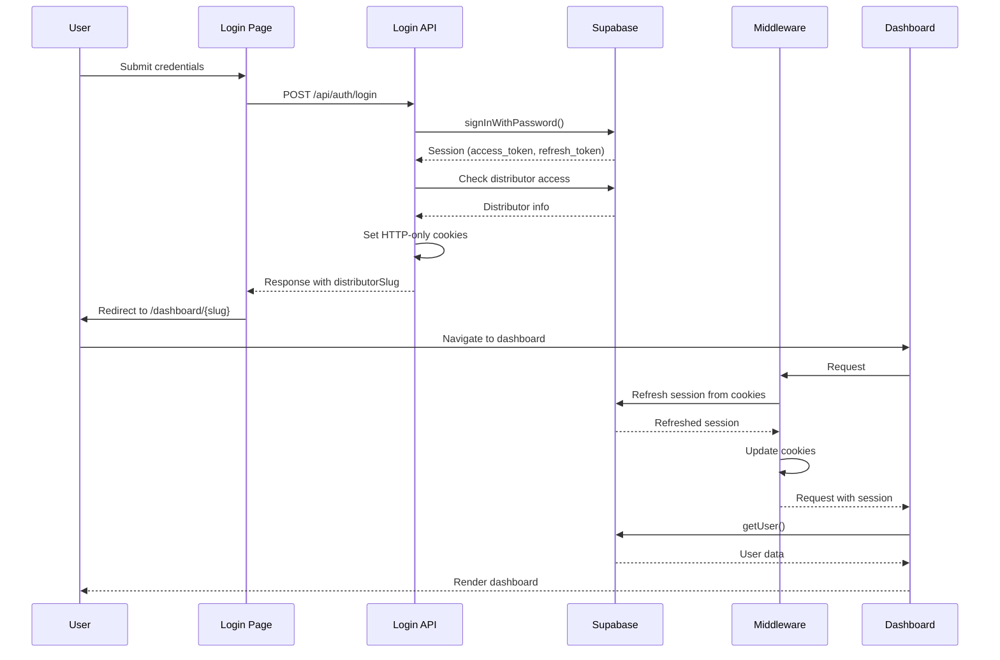

# Login Fix Implementation Plan

## Overview

This document provides a step-by-step implementation plan to fix all critical login issues identified in the audit report.

---

## Phase 1: Foundation - Cookie Storage & Middleware

### Step 1: Update `lib/supabase/client.ts`

**File:** [`lib/supabase/client.ts`](lib/supabase/client.ts)

**Changes:**
- Replace `@supabase/supabase-js` with `@supabase/ssr` browser client
- Configure cookie storage instead of localStorage
- Add proper auth options

**New Code:**
```typescript
import { createBrowserClient } from '@supabase/ssr';
import { Database } from '@/types/supabase';

/**
 * Browser client for Supabase with cookie storage.
 * This client is used in client components and handles authentication state.
 * Uses cookies instead of localStorage for SSR compatibility.
 */
export const createClient = () => {
  const supabaseUrl = process.env.NEXT_PUBLIC_SUPABASE_URL;
  const supabaseAnonKey = process.env.NEXT_PUBLIC_SUPABASE_ANON_KEY;

  if (!supabaseUrl || !supabaseAnonKey) {
    throw new Error('Missing Supabase environment variables');
  }

  return createBrowserClient<Database>(
    supabaseUrl,
    supabaseAnonKey,
    {
      auth: {
        persistSession: true,
        autoRefreshToken: true,
        detectSessionInUrl: false,
      },
    }
  );
};
```

**Why:** The `createBrowserClient` from `@supabase/ssr` properly handles cookie storage, which is required for server-side authentication in Next.js 15+.

---

### Step 2: Create `middleware.ts`

**File:** `middleware.ts` (new file at project root)

**Purpose:** Automatically refresh Supabase sessions and ensure cookies are properly maintained.

**Code:**
```typescript
import { createServerClient, type CookieOptions } from '@supabase/ssr';
import { NextResponse, type NextRequest } from 'next/server';

export async function middleware(request: NextRequest) {
  let supabaseResponse = NextResponse.next({
    request,
  });

  const supabase = createServerClient(
    process.env.NEXT_PUBLIC_SUPABASE_URL!,
    process.env.NEXT_PUBLIC_SUPABASE_ANON_KEY!,
    {
      cookies: {
        getAll() {
          return request.cookies.getAll();
        },
        setAll(cookiesToSet) {
          cookiesToSet.forEach(({ name, value, options }) => {
            request.cookies.set(name, value);
            supabaseResponse.cookies.set(name, value, options);
          });
        },
      },
    }
  );

  // IMPORTANT: Avoid writing any logic between createServerClient and
  // supabase.auth.getUser(). A simple mistake could make it very hard to debug
  // issues with users being randomly logged out.

  const {
    data: { user },
  } = await supabase.auth.getUser();

  // Protected routes - redirect to login if not authenticated
  const isProtectedRoute = request.nextUrl.pathname.startsWith('/dashboard');
  const isAuthRoute = request.nextUrl.pathname.startsWith('/login') || 
                      request.nextUrl.pathname.startsWith('/register');

  if (isProtectedRoute && !user) {
    const url = request.nextUrl.clone();
    url.pathname = '/login';
    return NextResponse.redirect(url);
  }

  // Redirect authenticated users away from auth pages
  if (isAuthRoute && user) {
    const url = request.nextUrl.clone();
    url.pathname = '/dashboard';
    return NextResponse.redirect(url);
  }

  return supabaseResponse;
}

export const config = {
  matcher: [
    /*
     * Match all request paths except for the ones starting with:
     * - _next/static (static files)
     * - _next/image (image optimization files)
     * - favicon.ico (favicon file)
     * Feel free to modify this pattern to include more paths.
     */
    '/((?!_next/static|_next/image|favicon.ico|.*\\.(?:svg|png|jpg|jpeg|gif|webp)$).*)',
  ],
};
```

**Why:** Middleware is essential for:
- Automatically refreshing expired sessions
- Ensuring cookies are properly set on every request
- Protecting routes and handling redirects

---

## Phase 2: Fix Login API Route

### Step 3: Update `app/api/auth/login/route.ts`

**File:** [`app/api/auth/login/route.ts`](app/api/auth/login/route.ts)

**Changes:**
- Set HTTP-only cookies for access and refresh tokens
- Remove tokens from response body (security best practice)
- Add proper error handling for missing RPC function

**Key Changes:**

1. **Import cookie utilities:**
```typescript
import { NextRequest, NextResponse } from 'next/server';
import { adminClient } from '@/lib/supabase/admin';
import { z } from 'zod';
import { cookies } from 'next/headers';
```

2. **Update the success response (lines 135-149):**
```typescript
// Set cookies for session persistence
const cookieStore = await cookies();

// Set access token cookie
cookieStore.set('sb-access-token', authData.session.access_token, {
  httpOnly: true,
  secure: process.env.NODE_ENV === 'production',
  sameSite: 'lax',
  path: '/',
  maxAge: 60 * 60, // 1 hour
});

// Set refresh token cookie
cookieStore.set('sb-refresh-token', authData.session.refresh_token, {
  httpOnly: true,
  secure: process.env.NODE_ENV === 'production',
  sameSite: 'lax',
  path: '/',
  maxAge: 60 * 60 * 24 * 7, // 7 days
});

// Return success without exposing tokens in response
return NextResponse.json(
  {
    success: true,
    message: 'Login successful',
    data: {
      userId: newProfile.id,
      email: newProfile.email,
      fullName: newProfile.full_name,
      distributorSlug,
    },
  },
  { status: 200 }
);
```

3. **Add fallback for missing RPC function (around line 106):**
```typescript
// Try RPC first, fall back to direct query if RPC doesn't exist
let distributorUsers;
let distributorUsersError;

try {
  const result = await adminClient.rpc('get_distributor_users', {
    p_user_id: newProfile.id
  });
  distributorUsers = result.data;
  distributorUsersError = result.error;
} catch (rpcError) {
  console.log('RPC function not found, using direct query');
  // Fallback to direct query
  const result = await adminClient
    .from('distributor_users')
    .select(`
      *,
      distributors!inner (
        name,
        slug
      )
    `)
    .eq('user_id', newProfile.id)
    .eq('is_active', true);

  distributorUsers = result.data?.map(du => ({
    ...du,
    distributor_name: du.distributors.name,
    distributor_slug: du.distributors.slug,
  }));
  distributorUsersError = result.error;
}
```

**Why:** 
- HTTP-only cookies are more secure than storing tokens in localStorage
- Removing tokens from response body prevents token leakage
- Fallback for RPC function ensures login works even if the function isn't created

---

## Phase 3: Fix Login Page

### Step 4: Update `app/(auth)/login/page.tsx`

**File:** [`app/(auth)/login/page.tsx`](app/(auth)/login/page.tsx)

**Changes:**
- Remove manual `setSession()` call (cookies are set by API)
- Simplify the login flow
- Add better error handling

**Updated handleSubmit function:**
```typescript
const handleSubmit = async (e: React.FormEvent) => {
  e.preventDefault();
  setIsLoading(true);
  setError(null);

  try {
    console.log('=== FRONTEND LOGIN START ===');
    console.log('Submitting login request for email:', email);

    // Call the login API endpoint
    const response = await fetch('/api/auth/login', {
      method: 'POST',
      headers: {
        'Content-Type': 'application/json',
      },
      body: JSON.stringify({ email, password }),
    });

    console.log('Response status:', response.status);
    const data = await response.json();
    console.log('Response data:', data);

    if (!response.ok) {
      console.error('Login failed:', data.error);
      throw new Error(data.error || 'Ocurrió un error inesperado. Por favor, intenta nuevamente.');
    }

    console.log('Login successful, redirecting to dashboard...');
    console.log('Distributor slug:', data.data.distributorSlug);

    // Cookies are set by the API, no need to call setSession
    // The middleware will handle session refresh on the next request

    // Redirect to the dashboard
    router.push(`/dashboard/${data.data.distributorSlug}`);
    console.log('=== FRONTEND LOGIN END ===');
  } catch (err) {
    console.error('Login error:', err);
    setError(err instanceof Error ? err.message : 'Ocurrió un error inesperado. Por favor, intenta nuevamente.');
  } finally {
    setIsLoading(false);
  }
};
```

**Why:** 
- Cookies are now set by the API endpoint, so manual `setSession()` is not needed
- Simplifies the code and removes potential race conditions
- The middleware will handle session refresh automatically

---

## Phase 4: Add Logout Functionality

### Step 5: Create `app/api/auth/logout/route.ts`

**File:** `app/api/auth/logout/route.ts` (new file)

**Purpose:** Properly clear the session and cookies on logout.

**Code:**
```typescript
import { NextRequest, NextResponse } from 'next/server';
import { adminClient } from '@/lib/supabase/admin';
import { cookies } from 'next/headers';

export async function POST(request: NextRequest) {
  try {
    const cookieStore = await cookies();

    // Get the access token from cookies
    const accessToken = cookieStore.get('sb-access-token')?.value;

    if (accessToken) {
      // Sign out from Supabase
      await adminClient.auth.signOut();
    }

    // Clear cookies
    const response = NextResponse.json(
      { success: true, message: 'Logged out successfully' },
      { status: 200 }
    );

    response.cookies.delete('sb-access-token');
    response.cookies.delete('sb-refresh-token');

    return response;
  } catch (error) {
    console.error('Logout error:', error);
    return NextResponse.json(
      { error: 'An error occurred during logout' },
      { status: 500 }
    );
  }
};
```

### Step 6: Add Logout Button to Dashboard Layout

**File:** [`app/(dashboard)/dashboard/[slug]/layout.tsx`](app/(dashboard)/dashboard/[slug]/layout.tsx)

**Changes:** Add a logout button in the sidebar footer.

**Add to sidebar footer (around line 79):**
```typescript
<div className="p-4 border-t border-gray-200 space-y-3">
  <div className="flex items-center gap-3">
    <div className="w-10 h-10 bg-gray-200 rounded-full flex items-center justify-center">
      <span className="text-sm font-medium text-gray-600">
        {user.email?.charAt(0).toUpperCase()}
      </span>
    </div>
    <div className="flex-1 min-w-0">
      <p className="text-sm font-medium text-gray-900 truncate">
        {user.email}
      </p>
      <p className="text-xs text-gray-500">Miembro</p>
    </div>
  </div>
  
  <form action="/api/auth/logout" method="POST">
    <Button type="submit" variant="outline" className="w-full">
      Cerrar Sesión
    </Button>
  </form>
</div>
```

---

## Phase 5: Database Verification

### Step 7: Verify RPC Function Exists

**Action:** Run the SQL file [`create-rpc-function.sql`](create-rpc-function.sql) in Supabase SQL Editor if not already done.

**SQL:**
```sql
CREATE OR REPLACE FUNCTION get_distributor_users(p_user_id UUID)
RETURNS TABLE (
  id UUID,
  distributor_id UUID,
  user_id UUID,
  role VARCHAR(50),
  is_active BOOLEAN,
  created_at TIMESTAMPTZ,
  updated_at TIMESTAMPTZ,
  distributor_name VARCHAR(255),
  distributor_slug VARCHAR(50)
)
LANGUAGE plpgsql
SECURITY DEFINER
AS $$
BEGIN
  RETURN QUERY
  SELECT
    du.id,
    du.distributor_id,
    du.user_id,
    du.role,
    du.is_active,
    du.created_at,
    du.updated_at,
    d.name as distributor_name,
    d.slug as distributor_slug
  FROM distributor_users du
  JOIN distributors d ON du.distributor_id = d.id
  WHERE du.user_id = p_user_id;
END;
$$;
```

**Why:** Ensures the RPC function exists for the login API to use.

---

## Phase 6: Testing & Validation

### Step 8: Test Complete Login Flow

**Test Cases:**

1. **Successful Login:**
   - Navigate to `/login`
   - Enter valid credentials
   - Verify redirect to `/dashboard/{slug}`
   - Verify dashboard loads correctly
   - Refresh page - verify user stays logged in

2. **Invalid Credentials:**
   - Enter invalid email/password
   - Verify error message displays
   - Verify no redirect occurs

3. **Session Persistence:**
   - Login successfully
   - Close browser
   - Reopen and navigate to `/dashboard/{slug}`
   - Verify user is still logged in (if cookies persist)

4. **Logout:**
   - Click logout button
   - Verify redirect to `/login`
   - Verify cookies are cleared
   - Try to access `/dashboard/{slug}` - verify redirect to `/login`

5. **Protected Routes:**
   - Try to access `/dashboard/{slug}` without logging in
   - Verify redirect to `/login`

---

## File Structure After Changes

```
├── middleware.ts                    # NEW - Session management
├── app/
│   ├── api/
│   │   └── auth/
│   │       ├── login/
│   │       │   └── route.ts        # MODIFIED - Sets cookies
│   │       └── logout/             # NEW - Logout endpoint
│   │           └── route.ts
│   ├── (auth)/
│   │   └── login/
│   │       └── page.tsx            # MODIFIED - Simplified flow
│   └── (dashboard)/
│       └── dashboard/
│           └── [slug]/
│               └── layout.tsx      # MODIFIED - Added logout button
└── lib/
    └── supabase/
        ├── admin.ts                 # Unchanged
        ├── client.ts               # MODIFIED - Uses SSR client
        └── server.ts                # Unchanged
```

---

## Mermaid Diagram: Fixed Login Flow



---

## Success Criteria

- [ ] User can login with valid credentials
- [ ] User is redirected to correct dashboard after login
- [ ] Session persists across page refreshes
- [ ] User stays logged in after closing and reopening browser
- [ ] Logout functionality works correctly
- [ ] Protected routes redirect unauthenticated users to login
- [ ] No console errors during login flow
- [ ] Cookies are set as HTTP-only and secure (in production)

---

## Risk Mitigation

| Risk | Mitigation |
|------|------------|
| Breaking existing auth flow | Keep same redirect logic, only change session storage |
| Cookie not persisting | Use proper cookie options (httpOnly, secure, sameSite) |
| Middleware causing issues | Test thoroughly, can be disabled if needed |
| RPC function missing | Added fallback to direct query |
| Session not refreshing | Middleware handles automatic refresh |

---

## Notes

- The `@supabase/ssr` package is designed specifically for Next.js and handles the complexities of cookie-based authentication
- Middleware runs on every request, so it's important to keep it efficient
- HTTP-only cookies prevent XSS attacks from stealing tokens
- The `sameSite: 'lax'` option allows cookies to be sent on top-level navigations

---

## References

- [Supabase Next.js App Router Guide](https://supabase.com/docs/guides/auth/server-side/nextjs)
- [Supabase SSR Package Documentation](https://supabase.com/docs/reference/javascript/ssr)
- [Next.js Middleware Documentation](https://nextjs.org/docs/app/building-your-application/routing/middleware)
- [HTTP-Only Cookies Security](https://owasp.org/www-community/controls/HttpOnly)
